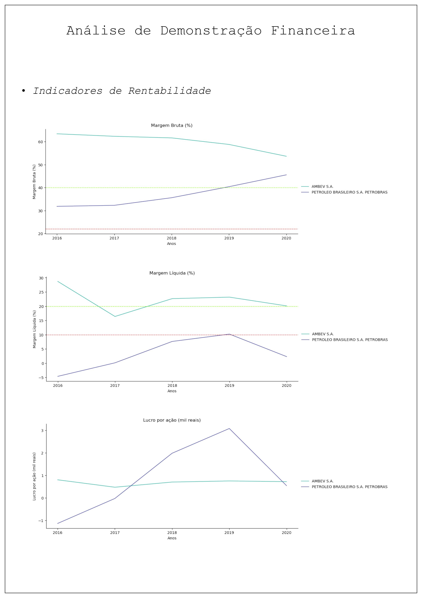
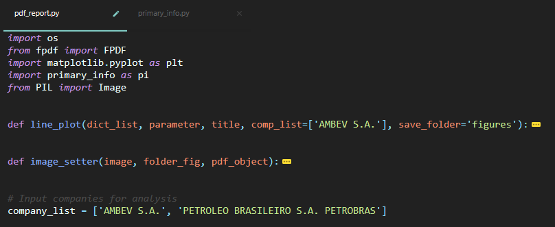
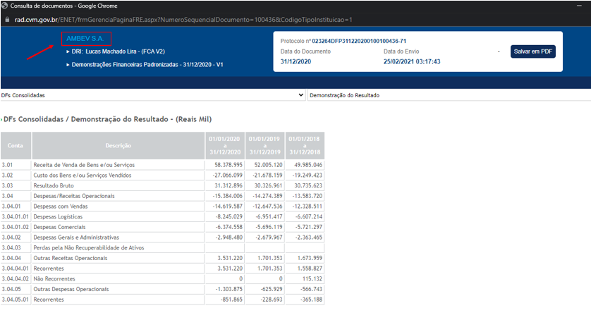

# Analisador de Demonstrativos Financeiros (DFPs)

## Descrição

O presente programa propõe coletar as demonstrações financeiras anuais de empresas listadas na bolsa de valores, trabalhar esses dados e gerar um relatório em formato PDF com informações de interesse. O objetivo do software é analisar a situação financeira de uma empresa ao longo dos anos ou comparar um grupo de empresas entre si, orientando-se segundo métricas baseadas nas recomendações do livro "Warren Buffett e a Análise de Balanços".

Uma breve exibição da aparência e formatação do documento está disposta a seguir.

## Tópicos para o Usuário

### Bibliotecas Utilizadas

Para executar o programa, o usuário deve certificar-se de baixar as seguintes bibliotecas:

- [fpdf](https://pypi.org/project/fpdf/)
- [Matplotlib](https://pypi.org/project/matplotlib/)
- [Pillow](https://pypi.org/project/Pillow/)
- [Pandas](https://pypi.org/project/pandas/)
- [Numpy](https://pypi.org/project/numpy/)

### Como Alimentar o Programa com as Demonstrações

A Comissão de Valores Mobiliários (CVM) disponibiliza, nesse [LINK](http://dados.cvm.gov.br/dataset/cia_aberta-doc-dfp), arquivos contendo as demonstrações financeiras de todas as companhias listadas na bolsa de valores para o ano em questão. Portanto, um único download já é suficiente para acessar qualquer dado daquele ano.

Dessa forma, para baixar o arquivo compactado (.zip), basta acessar os formulários de demonstrações financeiras no tópico "Dados e recursos" e depois clicar no link indicado na imagem abaixo. O exemplo dado nas imagens faz o processo para o ano 2018, mas o usuários pode baixar demonstrações de 2017 até o presente.

Esses arquivos compactados devem ser salvos, pelo usuário, na pasta "raw_dfp/raw_zip" para que o programa inclua o ano em questão na análise. Por padrão, já estão disponíveis arquivos para os anos de 2017 a 2020.

>ATENÇÃO para a data em que é feito o dowload, principalmente entre janeiro e março! As demonstrações anuais normalmente são entregues pelas empresas ao longo de fevereiro do ano seguinte. Dessa forma, o usuário pode baixar um arquivo .zip desatualizado com somente uma parte das empresas, assim como esquecer que os dados daquele arquivo estão desatualizados e usá-lo meses depois.

### Como Inserir Empresas para Análise

O programa suporta a análise de uma ou múltiplas empresas. Obviamente, caso o usuário insira muitas empresas os gráficos ficarão com a visualização prejudicada.

Para indicar as empresas a serem analisadas, basta preencher a variável "company_list" localizada no arquivo "pdf_report.py" logo após as funcões iniciais. Portanto, recomenda-se minimizar as funções iniciais como no exemplo abaixo para acessar mais facilmente a variável. Os nomes são dados sob o formato de uma lista de strings. Abaixo temos um exemplo em que foram fornecidas as empresas AMBEV e Petrobrás.

>ATENÇÂO para o nome das empresas inseridas. Infelizmente, o software é sensível aos caracteres, logo, qualquer caracter alterado acarretará no não reconhecimento da empresa e no preenchimento de todos os gráficos com o valor 0. Recomenda-se checar o nome da companhia no site da CVM ou em uma demonstração financeira lançada. Tomando a AMBEV como exemplo, o nome da companhia pode ser encontrado no topo de qualquer demonstração financeira.

### Como Executar o Programa

Para executar o programa, basta executar o arquivo pdf_report.py. Caso haja arquivos na pasta "raw_dfp/raw_zip" e as empresas já estejam especificadas na variável descrita no tópico anterior, o programa deverá funcionar normalmente.

### Cuidados ao Abrir o PDF

Caso o usuário deseje executar o programa múltiplas vezes em sequência e precise atualizar o PDF, recomenda-se abrir o PDF no navegador ao invés de um leitor de PDF tradicional. Isso se deve à particularidade da biblioteca responsável por editar o documento, que crasha o programa caso o PDF a ser editado já esteja aberto em um visualizador tradicional.

Portanto, caso o usuário rode o programa uma vez, abra o PDF em um visualizador e rode novamente o programa, o mesmo irá crashar até que o usuário execute o software com o visualizador fechado. Para resolver esse problema, basta abrir o PDF no navegador e atualizar a página quando a execução do programa terminar.

### Dados de interesse

Os dados de interesse são baseados nas recomendações do livro ["Warren Buffett e a Análise de Balanços"](https://www.amazon.com.br/Warren-Buffett-an%C3%A1lise-balan%C3%A7os-Exclusiva/dp/6555640758). A lista de dados atualmente reportados está a seguir:

 - *Margem Bruta (%)*
 - *Margem Líquida (%)*
 - *Lucro por ação (mil reais)*
 - *ROE (%)*
 - *ROA (%)*
 - *Lucro Bruto (mil reais)*
 - *Lucro Líquido (mil reais)*
 - *Lucro Acmulado (mil reais)*
 - *Ativo Circulante (mil reais)*
 - *Despesas com Vendas, Gerais e Administrativas sobre o Lucro Bruto (%)*
 - *Despesas com Pesquisa sobre o Lucro Bruto (%)*
 - *Depreciação sobre o Lucro Bruto (%)*
 - *Despesas com Juros sobre Lucro Operacional (%)*
 - *Coeficiente de iquidez*
 - *Passivo Total sobre Patrimônio Líquido*
 - *Ativo imobilizado (mil reais)*
 - *Despesas com Ativos Fixos sobre o Lucro Líquido (%)*

>Observação 1: algumas variáveis como, por exemplo, as despesas, são reportadas como valores negativos. A interpretação do sinal dos valores e seu significado depende do conhecimento do leitor sobre como essas variáveis são reportadas nas DFPs e, portanto, são responsabilidade do usuário. Vale o alerta acerca de eventos inesperados como lucros negativos, que podem fazer, por exemplo, gráficos de despesas com juros ficarem positivos (o que indicaria lucro no resultado financeiro). Para evitar esse tipo de confusão, basta cruzar as informações entre gráficos ou até mesmo conferir no demonstrativo do ano correspondente para descobrir eventuais armadilhas com os sinais dos números.

>Observação 2: alguns gráficos tem linhas horizontais que, segundo o livro de referência, podem indicar uma vantagem competitiva da companhia, uma empresa num ramo muito competitivo ou uma empresa com problemas internos. Linhas verdes indicam possíveis vantagens competitivas (como uma margem bruta acima de 40%) e linhas vermelhas indicam pontos problemáticos. Vale lembrar que essas indicações não são determinantes para a análise de uma empresa, mas podem ajudar a encontrar bons negócios.

### Tempo de Execução

O tempo de execução do programa gira em torno de 1 a 2 minutos. Esse tempo se concetra principalemente nas etapas de criar os plots e editar o documento. Até o momento, não se investiu em formas de agilizar esse processo

### Possíveis problemas

#### Gráfico sem Preechimento ou somente com Valores 0
